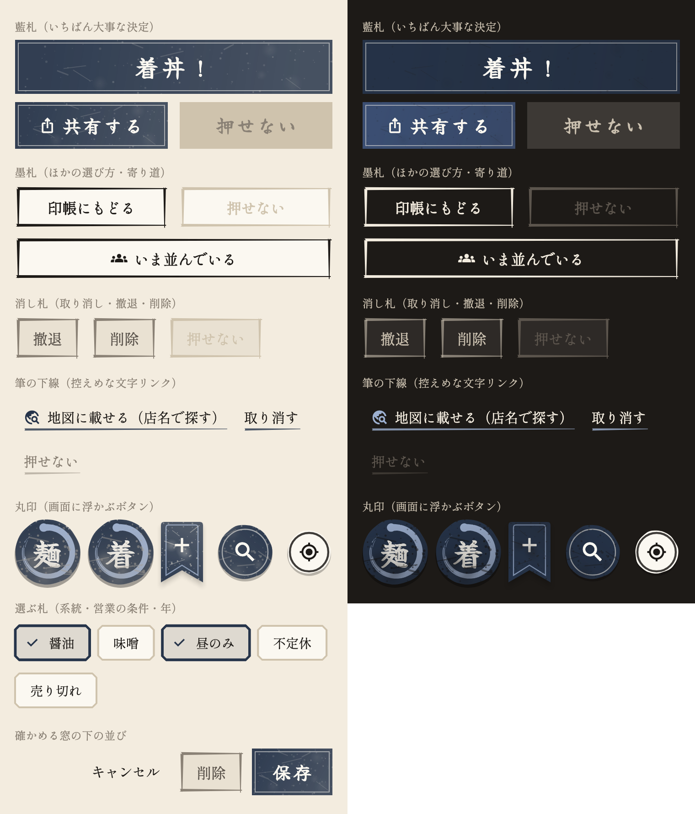
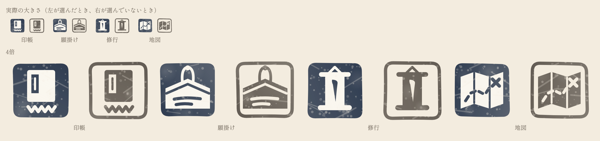

# ボタンの見本帳

アプリのボタンを、役割ごとに見比べるための見本（確認用）。ボタンなど画面の部品はアイコンの藍で描き、朱は印だけに使う。左が和紙の画面、右が墨色の画面（着丼直後の画面・並び中の帯）。

| 見た目 | 役割 | 使っているところ |
|---|---|---|
| 藍札（藍の地に和紙色の細い枠、筆文字） | その画面でいちばん大事な決定 | 着丼！・保存・共有する・並んだ・願を掛ける・書き出す・下書きに残してやめる |
| 墨札（筆で4辺を引いた枠） | ほかの選び方・別の画面への寄り道 | 印帳にもどる・いま並んでいる・カメラで撮る／ギャラリーから選ぶ・この店のページを見る・その一杯を見る・読み込む・もう一度探す |
| 消し札（灰の地に薄墨の枠） | 取り消し・撤退・削除 | 撤退・撤退を記録・削除・破棄してやめる・破棄して新しく記録する・取り消す（確かめる窓） |
| 筆の下線（藍の筆で下線を引いた文字） | 控えめな寄り道 | 地図に載せる・全国の店から探す・撮り直す・旅路を再生・遠征・叶えた・願を掛ける（思い出）・取り消す（並び中の帯）・下書きを捨てて新しく |
| 丸印（藍の丸に内側の輪／和紙に墨の輪） | 画面に浮かぶボタン | 記録の判子（筆の円相、かすれ付き。ふだんは「麺」、並んでいる最中は「着」）・このあたりを探す・現在地（墨の輪） |
| しおり（藍のしおりに和紙色の＋） | 願掛け帳で願を足す | 願を足す（記録の判子と取り違えないよう丸にしない） |
| 選ぶ札（角を落とした木札、選ぶと藍の縁とチェック） | 系統・営業の条件・年などを選ぶ | 記録・編集・修行録・地図の旅路・一年の振り返り・撤退の理由 |

## 下のタブのアイコン

手で押した印のような枠に、タブごとの小さな絵（印帳＝御朱印帳、願掛け＝絵馬、修行＝掛け軸、地図＝古地図）を描き、かすれをつける。選んでいるタブは藍で塗り、絵を和紙色で抜く。上が実際の大きさ、下が4倍。

- 絵は `lib/features/home/tab_seals.dart`。変えたら `flutter test --dart-define=UPDATE_TAB_SEALS=true test/tool/tab_seal_catalog_test.dart` で画像を作り直す

## 補足

- 部品は `lib/theme/washi_buttons.dart`、選ぶ札とほかの既定のボタンの色は `lib/theme/app_theme.dart`
- 画面上部の小さなアイコン・★・閉じる（×）・確かめる窓の「キャンセル」は、わかりやすさを優先して文字やアイコンだけのまま
- ボタンの見た目を変えたら `flutter test --dart-define=UPDATE_BUTTON_CATALOG=true test/tool/button_catalog_test.dart` で画像を作り直す
