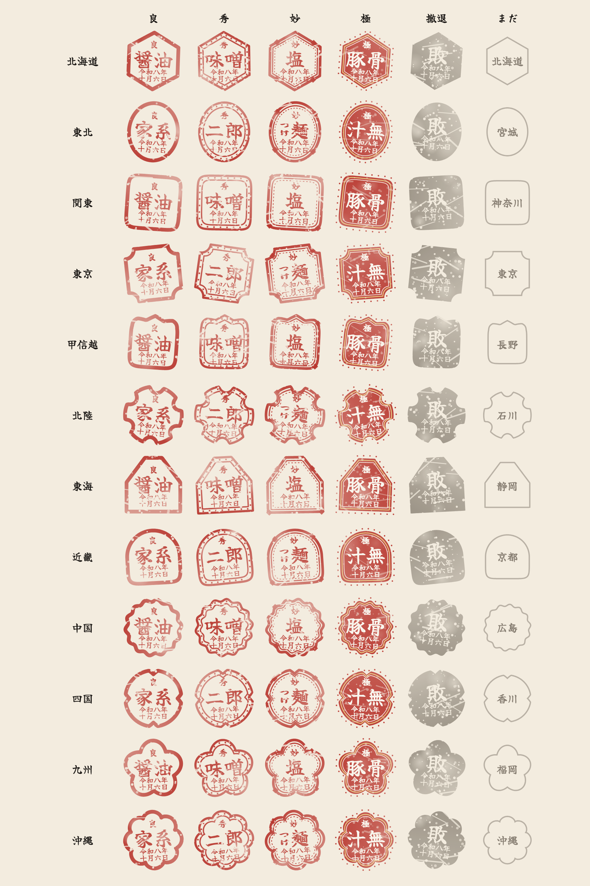

# 地方の印

1杯ごとの印の外枠は、店のある都道府県の地方で形が変わる（東京都だけは関東と別の形）。管理用。

- 外枠は `lib/features/inkan/region_frame.dart`、格の飾りは `lib/features/inkan/inkan_stamp.dart` の `RegionalInkanPainter`
- 格（良・秀・妙・極。1杯の修行点の高さ）の飾りは外枠の上に重ねる: 良＝細い枠 / 秀＝二重枠と点の輪 / 妙＝三重枠と点線と四隅の菱形 / 極＝朱塗りと金の輪と外側の点
- 印の下に短い都道府県名（「東京」「北海道」など）を入れる。都道府県のわからない店は、今までの丸・角の印のまま
- 撤退の印も地方の形で灰色に塗る
- 印の描き方を変えたら `flutter test --dart-define=UPDATE_SEAL_CATALOG=true test/tool/seal_catalog_test.dart` で、この一覧と画像を作り直す（作り直さないとテストが失敗する）

| 外枠 | 形 | 都道府県 | 見本 |
|---|---|---|---|
| 北海道 | 雪の結晶のような、角を上にした六角 | 北海道 | 北海道 |
| 東北 | 米粒のような縦長の楕円 | 青森県・岩手県・宮城県・秋田県・山形県・福島県 | 宮城県 |
| 関東 | 角印（角の丸い四角） | 茨城県・栃木県・群馬県・埼玉県・千葉県・神奈川県 | 神奈川県 |
| 東京 | 隅入り角（江戸の家紋の、四隅を丸くえぐった角印）。印帳では関東に入る | 東京都 | 東京都 |
| 甲信越 | 上に三つの山を持つ四角 | 新潟県・山梨県・長野県 | 長野県 |
| 北陸 | 雪輪（六つの丸い切れ込みのある輪） | 富山県・石川県・福井県 | 石川県 |
| 東海 | 富士の稜線（裾の広い山形に平らな頂） | 岐阜県・静岡県・愛知県・三重県 | 静岡県 |
| 近畿 | 瓦（下は角、上は丸い） | 滋賀県・京都府・大阪府・兵庫県・奈良県・和歌山県 | 京都府 |
| 中国 | 瀬戸内の波（細かくうねる輪） | 鳥取県・島根県・岡山県・広島県・山口県 | 広島県 |
| 四国 | 四つ割り（上下左右に切れ込みのある輪） | 徳島県・香川県・愛媛県・高知県 | 香川県 |
| 九州 | 椿（五枚の丸い花びら） | 福岡県・佐賀県・長崎県・熊本県・大分県・宮崎県・鹿児島県 | 福岡県 |
| 沖縄 | 南国の花（デイゴ。八枚の花びら） | 沖縄県 | 沖縄県 |

<!-- 描き方の指紋: 8110e8e4 -->
